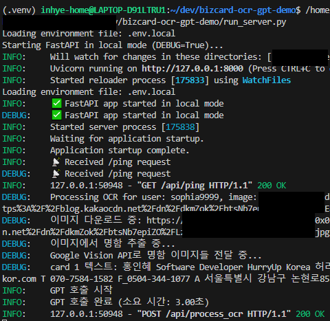
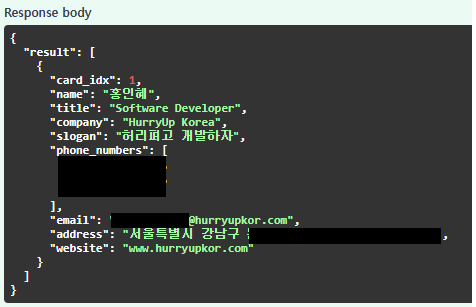

# Bizcard OCR + GPT Demo

This project demonstrates a simplified and modularized version of a business card information extraction pipeline,  
based on a team project I participated in during my time at work.

It has been rebuilt using mock data and publicly available APIs (e.g., Google Vision, OpenAI) to ensure reusability and shareability.

## 🧑‍💻 Technology Stack

- **Backend Framework**: FastAPI
- **OCR**: Google Vision API
- **Text Classification**: OpenAI GPT (GPT-4o-mini)
- **Database**: None (this application is a just pipeline for OCR)
- **Testing**: pytest for unit testing
- **Environment Management**: venv for managing dependencies

## ⚙️ Features
- Simulated image processing & OCR flow with Google Vision API
- Prompt engineering for structured GPT responses (name, company, etc.)
- Modular FastAPI project layout with organized services and routes
- Logging, environment separation
- Unit tests with `pytest` 

## Project Structure
```
📦bizcard-ocr-gpt-demo
 ┣ 📂app
 ┃ ┣ 📂api
 ┃ ┃ ┣ 📜__init__.py
 ┃ ┃ ┗ 📜ocr.py
 ┃ ┣ 📂core
 ┃ ┃ ┣ 📜__init__.py
 ┃ ┃ ┗ 📜config.py
 ┃ ┣ 📂service
 ┃ ┃ ┣ 📜__init__.py
 ┃ ┃ ┣ 📜gpt_service.py
 ┃ ┃ ┣ 📜image_service.py
 ┃ ┃ ┗ 📜ocr_service.py
 ┃ ┣ 📂util
 ┃ ┃ ┣ 📜__init__.py
 ┃ ┃ ┗ 📜logger.py
 ┃ ┗ 📜main.py
 ┣ 📂secrets
 ┣ 📂tests
 ┃ ┣ 📜test_api.py
 ┃ ┣ 📜test_gpt_call.py
 ┃ ┗ 📜test_gpt_service.py
 ┣ 📜.env.example
 ┣ 📜.gitignore
 ┣ 📜gunicorn.conf.py
 ┣ 📜README.md
 ┣ 📜requirements.txt
 ┗ 📜run_server.py
 ```

## 🛠 Installation & Setup

1. Clone the repository:
    ```bash
    git clone https://github.com/yourusername/bizcard-ocr-gpt-demo.git
    cd bizcard-ocr-gpt-demo
    ```

2. Create and activate a Python environment (`.venv`):
    ```bash
    python -m venv .venv
    source .venv/bin/activate  # MacOS/Linux
    # 또는
    .venv\Scripts\activate  # Windows
    ```

3. Install the necessary dependencies:
    ```bash
    pip install -r requirements.txt
    ```

4. Set up the `.env` file with your API keys and credentials and other settings. you can refer .env.example files to fill out:
    ```env
    GOOGLE_APPLICATION_CREDENTIALS=path/to/your/google-vision-key.json
    OPENAI_API_KEY=your-openai-api-key
    UVICORN_HOST=0.0.0.0 (for external access, for local test 127.0.0.1)
    UVICORN_PORT=8000
    UVICORN_RELOAD=true (for development environment)
    ...
    ```

5. Run the server:
    ```bash
    python ENV=dev run_server.py
    ```

6. Test the endpoints using `pytest`:
    ```bash
    PYTHONPATH=. pytest -v
    ```

## 🚀 API Endpoints

After you start "python run_server.py", you can see at http://localhost:port/docs

### POST `/api/process_ocr`

- **Description**: Processes a business card image URL, extracts the text, and returns the classified data.
- **Request Body**:
    ```json
    {
        "user_id": "test_user",
        "user_email": "test@example.com",
        "image_url": "https://dummy.image.url/card.jpg"
    }
    ```

- **Response Body**:
    ```json
    {
        "result": [
            {
                "card_idx": 1,
                "name": ["John Doe"],
                "company": ["Example Inc."],
                "phone_numbers": ["010-1234-5678"],
                    // Custom depending on prompt
            }
        ]
    }
    ```


## 🔐 Disclaimer
This repository does not include any proprietary code or data from the original project.  
All content is public, simulated, or self-developed for learning and demonstration purposes only.

## 🧪 For Testing
You can run unit tests using `pytest` to verify the core functionalities:
```bash
PYTHONPATH=. pytest -v
```

## 🎞 Demo Images 

- if you send formatted requests, you can see logs like below image.


- and then, the response data will look like this image. You can customize the reponse data with sophisticated prompt engineering.  
